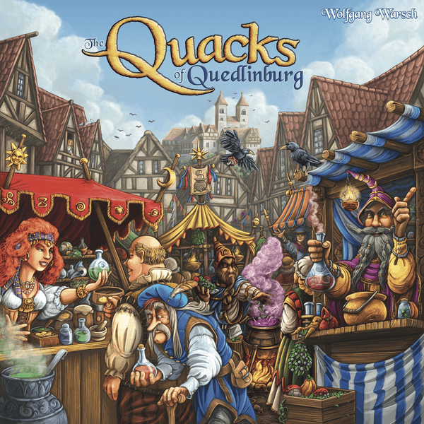

# Quacks

   

## Site

- [Published](https://alexhedley.github.io/quacks)

## Run

`py -m http.server`

- [local](http://localhost:8000/)

## Docs

- [docs](docs/README.md)

## License

- [MIT License](LICENSE)
